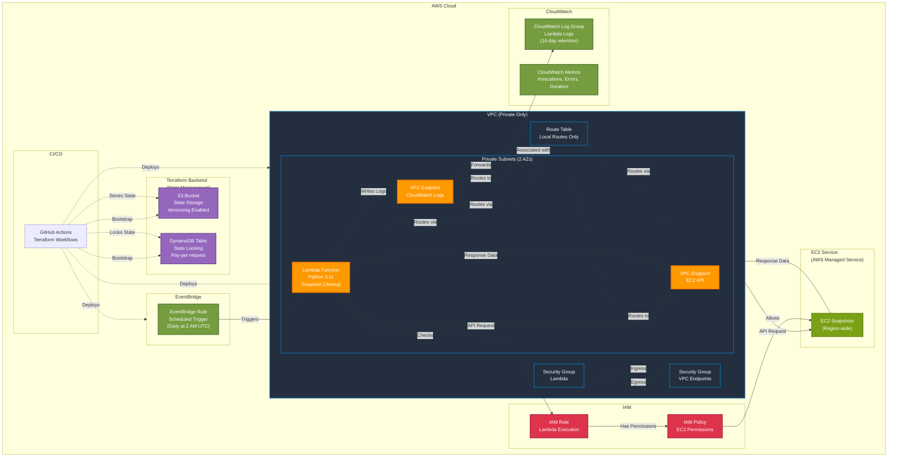

# AWS Lambda EC2 Snapshot Cleanup - Architecture Diagram

## Architecture Overview



## Component Details

### Network Layer

```
┌─────────────────────────────────────────────────────────┐
│                      VPC (10.0.0.0/16)                   │
│                                                          │
│  ┌──────────────────────┐  ┌──────────────────────┐    │
│  │ Private Subnet 1    │  │ Private Subnet 2     │    │
│  │ (AZ-1)              │  │ (AZ-2)               │    │
│  │ 10.0.0.0/24         │  │ 10.0.1.0/24          │    │
│  │                      │  │                      │    │
│  │  ┌──────────────┐   │  │  ┌──────────────┐    │    │
│  │  │ Lambda       │   │  │  │ VPC Endpoint │    │    │
│  │  │ Function     │   │  │  │ EC2 (ENI)    │    │    │
│  │  └──────────────┘   │  │  └──────────────┘    │    │
│  │                      │  │                      │    │
│  │  ┌──────────────┐   │  │  ┌──────────────┐    │    │
│  │  │ VPC Endpoint │   │  │  │ VPC Endpoint │    │    │
│  │  │ Logs (ENI)   │   │  │  │ EC2 (ENI)    │    │    │
│  │  └──────────────┘   │  │  └──────────────┘    │    │
│  └──────────────────────┘  └──────────────────────┘    │
│                                                          │
│  Route Table: Local routes only
└─────────────────────────────────────────────────────────┘
```

### Route Table

**What is a Route Table?**
A Route Table determines where network traffic from your subnets is directed. Every subnet must be associated with a route table.

**In This Architecture:**

```
Route Table (Private)
├── Associated with: Private Subnets (2 AZs)
├── Routes:
│   ├── 10.0.0.0/16 → Local (VPC CIDR)
│   
└── Result: All traffic stays within VPC
```


### Security Groups

```
Lambda Security Group (Outbound)
├── Allow: HTTPS (443) → VPC Endpoint Security Group
└── No inbound rules

VPC Endpoint Security Group (Inbound)
└── Allow: HTTPS (443) ← Lambda Security Group
```

**Key Points:**

```
EC2 Service (AWS Managed)
├── Location: AWS regional infrastructure (not in your VPC)
├── Contains: All EC2 snapshots in your AWS account/region
├── Access: Via EC2 API calls (DescribeSnapshots, DeleteSnapshot)
└── Connection: Through VPC Endpoint → AWS internal network → EC2 Service
```


**Request/Response Flow (Bidirectional):**

```
REQUEST (Lambda → EC2):
Lambda Function
  ↓ (HTTPS API Request: describe_snapshots())
VPC Endpoint (EC2 API)
  ↓ (AWS internal network)
EC2 Service (AWS managed)
  ↓ (queries)
EC2 Snapshots

RESPONSE (EC2 → Lambda):
EC2 Snapshots
  ↑ (snapshot data: IDs, creation dates, tags, etc.)
EC2 Service (AWS managed)
  ↑ (HTTPS API Response)
VPC Endpoint (EC2 API)
  ↑ (response data returned)
Lambda Function
```

**How Lambda Gets Data Back:**

1. **Lambda sends request**: `boto3.client('ec2').describe_snapshots()` → HTTPS request to VPC Endpoint
2. **VPC Endpoint forwards**: Request goes to AWS EC2 Service backend
3. **EC2 Service queries**: Retrieves snapshot data from its database
4. **EC2 Service responds**: Sends back JSON response with snapshot list
5. **VPC Endpoint returns**: Response comes back through VPC Endpoint
6. **Lambda receives data**: Lambda function gets the response with snapshot information

**Example Response Data Lambda Receives:**
```python
{
  'Snapshots': [
    {
      'SnapshotId': 'snap-1234567890',
      'StartTime': datetime(2023, 1, 1),
      'State': 'completed',
      'Tags': [...]
    },
    ...
  ]
}
```

**Security Groups Allow Both Directions:**
- Lambda egress: Allows Lambda to send requests OUT
- VPC Endpoint ingress: Allows VPC Endpoint to receive requests IN
- VPC Endpoint egress: Allows VPC Endpoint to send responses OUT (default AWS behavior)
- Lambda ingress: Allows Lambda to receive responses IN (default AWS behavior for established connections)

### Data Flow

```
1. EventBridge Rule triggers Lambda (scheduled)
   ↓
2. Lambda function starts execution
   ↓
3. Lambda queries EC2 API via VPC Endpoint
   ├── List all snapshots (DescribeSnapshots)
   ├── Check snapshot age (older than retention period)
   ├── Check exclusion tags (if configured)
   └── Delete old snapshots (DeleteSnapshot)
   ↓
4. Lambda writes logs to CloudWatch via VPC Endpoint
   ↓
5. CloudWatch Logs stores execution logs (14-day retention)
   ↓
6. CloudWatch Metrics captures invocation metrics
```

## Infrastructure Layers

This architecture consists of two infrastructure layers:

### 1. Backend Infrastructure (Terraform State Management)

**Purpose**: Provides remote state storage and locking for Terraform operations.

```
┌─────────────────────────────────────────┐
│      Terraform Backend Infrastructure   │
│                                         │
│  ┌──────────────┐  ┌──────────────┐   │
│  │ S3 Bucket    │  │ DynamoDB     │   │
│  │              │  │ Table        │   │
│  │ • Versioning │  │ • Pay-per-   │   │
│  │ • Encryption │  │   request    │   │
│  │ • Lifecycle  │  │ • LockID key │   │
│  └──────────────┘  └──────────────┘   │
│                                         │
│  Environment-Specific:                 │
│  • dev-ec2-snapshot-cleanup            │
│  • prod-ec2-snapshot-cleanup           │
└─────────────────────────────────────────┘
```

**Components:**
- **S3 Bucket**: Stores Terraform state files with versioning and encryption
- **DynamoDB Table**: Provides state locking to prevent concurrent modifications
- **Environment Isolation**: Separate backends per environment (dev/prod)

### 2. Application Infrastructure (Snapshot Cleanup)

**Purpose**: The actual EC2 snapshot cleanup solution (as shown in the main diagram above).

## Deployment Flow

### Complete Deployment Process

```
┌─────────────────────────────────────────┐
│          Deployment Workflow             │
└─────────────────────────────────────────┘

Step 1: Bootstrap Backend (One-time per environment)
┌─────────────────────────────────────────┐
│  cd backend/                               │
│  terraform init                            │
│  terraform apply -var-file=env/dev.tfvars  │
└─────────────────────────────────────────┘
       │
       ▼
┌─────────────────────────────────────────┐
│  Creates:                                 │
│  • S3 Bucket (dev-ec2-snapshot-cleanup)  │
│  • DynamoDB Table (dev-terraform-state-  │
│    lock)                                  │
└─────────────────────────────────────────┘
       │
       ▼
Step 2: Deploy Application Infrastructure
┌─────────────────────────────────────────┐
│  cd terraform/                            │
│  terraform init -backend-config=          │
│    backend-dev.hcl                        │
│  terraform apply -var-file=               │
│    ../env/dev/terraform.tfvars           │
└─────────────────────────────────────────┘
       │
       ▼
┌─────────────────────────────────────────┐
│  Creates:                                 │
│  • VPC with Private Subnets              │
│  • Lambda Function                        │
│  • VPC Endpoints                         │
│  • IAM Roles & Policies                  │
│  • EventBridge Rule                      │
│  • CloudWatch Log Group                  │
└─────────────────────────────────────────┘
```

### CI/CD Pipeline Flow

```
┌─────────────┐
│ GitHub Push │
└──────┬──────┘
       │
       ▼
┌─────────────────────────────────────────┐
│      GitHub Actions Workflow             │
│                                         │
│  ├──► terraform validate                │
│  ├──► terraform fmt (check)             │
│  ├──► terraform plan                    │
│  └──► terraform apply (on main branch)  │
│                                         │
│  Note: Assumes backend already exists   │
└──────┬──────────────────────────────────┘
       │
       ▼
┌─────────────────────────────────────────┐
│  State Management:                       │
│  • Reads state from S3                   │
│  • Acquires lock in DynamoDB             │
│  • Updates state in S3                   │
│  • Releases lock in DynamoDB             │
└─────────────────────────────────────────┘
       │
       ▼
┌─────────────────────────────────────────┐
│  AWS Resources Created/Updated          │
└─────────────────────────────────────────┘
```

## Project Structure

```
AWS/
├── backend/                    # Backend infrastructure (Terraform state)
│   ├── env/                    # Environment-specific backend configs
│   │   ├── dev.tfvars         # Dev backend: dev-ec2-snapshot-cleanup
│   │   └── prod.tfvars        # Prod backend: prod-ec2-snapshot-cleanup
│   ├── s3.tf                  # S3 bucket configuration
│   ├── dynamodb.tf            # DynamoDB table configuration
│   └── README.md              # Backend setup instructions
│
├── terraform/                  # Main application infrastructure
│   ├── main.tf                # VPC, Lambda, VPC Endpoints, etc.
│   ├── provider.tf            # Provider & backend configuration
│   ├── backend-dev.hcl        # Backend config for dev
│   ├── backend-prod.hcl       # Backend config for prod
│   └── README.md              # Deployment instructions
│
├── env/                        # Environment-specific variables
│   ├── dev/
│   │   └── terraform.tfvars   # Dev environment variables
│   └── prod/
│       └── terraform.tfvars   # Prod environment variables
│
├── lambda/                     # Lambda function code
│   ├── lambda_function.py     # Python 3.11 snapshot cleanup
│   └── requirements.txt       # Python dependencies
│
└── .github/workflows/          # CI/CD workflows
    ├── terraform.yml          # Terraform validation & deployment
    └── lambda-test.yml       # Lambda code validation
```

## Environment Management

The architecture supports **multi-environment deployments** with complete isolation:

### Environment Isolation

| Component | Dev Environment | Prod Environment |
|-----------|----------------|-----------------|
| **Backend S3** | `dev-ec2-snapshot-cleanup` | `prod-ec2-snapshot-cleanup` |
| **Backend DynamoDB** | `dev-terraform-state-lock` | `prod-terraform-state-lock` |
| **Lambda Function** | `dev-ec2-snapshot-cleanup` | `prod-ec2-snapshot-cleanup` |
| **VPC** | `dev-snapshot-cleanup-vpc` | `prod-snapshot-cleanup-vpc` |
| **State File** | `terraform.tfstate` (in dev bucket) | `terraform.tfstate` (in prod bucket) |

### Benefits of Environment Isolation

1. **State Isolation**: Each environment has its own state storage
2. **Independent Deployments**: Deploy to dev/prod independently
3. **Resource Isolation**: Resources are clearly separated by environment
4. **Security**: Reduced risk of cross-environment access
5. **Cost Tracking**: Easier to track costs per environment


